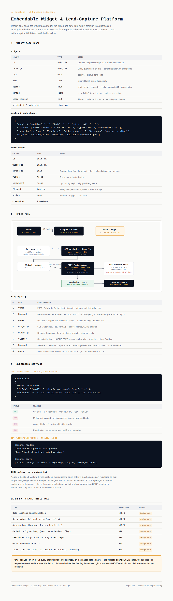

# Capstone — Embeddable Widget & Lead-Capture Platform


**Capstone:** Build a platform where a customer defines a widget, gets a one-line `<script>` embed snippet, drops it on any external site, and has submissions flow back — validated, enriched, spam-filtered, and dashboarded.

This repo currently contains **only the Wk3 design milestone** — no code yet. That's intentional: this capstone is explicitly staged (Wk3 design → Wk5/6 public endpoint → Wk8 delivery + dashboard + tests), and design mistakes are cheap to fix now and expensive to fix after the endpoint is built.



## What's in this milestone

| File | Description |
|---|---|
| `docs/wk3-design.html` | The full design doc: widget data model, embed flow (with diagram), and the submission contract. |
| `docs/wk3-design-preview.png` | Rendered screenshot of the doc above. |
| `docs/embed-flow-diagram.svg` | Standalone architecture diagram — owner → widget creation → embed → config delivery → submission → enrichment → storage → dashboard. |

## Widget data model (summary)

Two tables, tenant-isolated on every query:

- **`widgets`** — `id`, `tenant_id`, `type` (popover/signup_form/cta), `status` (draft/active/paused), `config` (jsonb: copy, fields, targeting, style), `embed_version`
- **`submissions`** — `id`, `widget_id`, `tenant_id` (denormalized for fast dashboard queries), `fields` (jsonb), `enrichment` (jsonb: ip/geo), `flagged`, `status`

Full column-by-column detail and the `config` JSON shape are in `docs/wk3-design.html`.

## Embed flow (summary)

```
Owner (authed) → POST /widgets → tenant-isolated widget created
              → embed snippet returned: <script data-widget-id="...">

Customer site (different origin) → loads widget.js
              → GET /widgets/:id/config (public, cached, CORS)
              → renders popover/form client-side

Visitor submits → CORS POST /submissions
              → validate → rate-limit → spam-check → enrich (geo fallback) → store
              → safe side-effect (email/webhook; failure here ≠ failed submission)

Owner dashboard (authed) → tenant-isolated submissions + stats
```

Full 8-step breakdown with a rendered diagram is in the design doc.

## Submission contract (summary)

**`POST /submissions`** — public, CORS-enabled
```json
{
  "widget_id": "uuid",
  "fields": { "email": "visitor@example.com" },
  "honeypot": ""
}
```
- `201` created · `400` malformed/missing fields · `404` unknown/inactive widget · `429` rate-limited

**`GET /widgets/:id/config`** — public, cached
- Headers: `Cache-Control: public, max-age=300`, `ETag`
- Body: `{ type, copy, fields, targeting, style, embed_version }`

CORS is enforced server-side on both routes (reflecting only registered/targeted origins), since this is explicitly the most-attacked surface in the whole program — untrusted browsers hitting a public endpoint, not an authenticated client.

## Why design-only right now

Every later milestone builds directly on the three shapes locked in this pass: the `config` JSON structure, the submission request contract, and the `tenant_id` isolation column on both tables. Getting these right now means Wk5/6 is implementation work against a fixed contract, not a redesign mid-build.

## Deferred to later milestones

| Item | Milestone |
|---|---|
| Rate limiting implementation | Wk5/6 |
| Geo provider fallback chain (real calls, mocked for deterministic tests) | Wk5/6 |
| Spam control (honeypot + heuristics) | Wk5/6 |
| Cached config delivery (real headers, ETag, versioned bundle) | Wk8 |
| Real embed script + second-origin test page | Wk8 |
| Owner dashboard + stats | Wk8 |
| Tests (CORS preflight, validation, rate limit, fallback) | Wk8 |

## Next milestone

Wk5/6: build the actual `POST /submissions` endpoint against the contract above — validation, CORS, rate limiting, spam control, and the geo enrichment fallback chain, with mocked providers so the fallback path is deterministically testable.