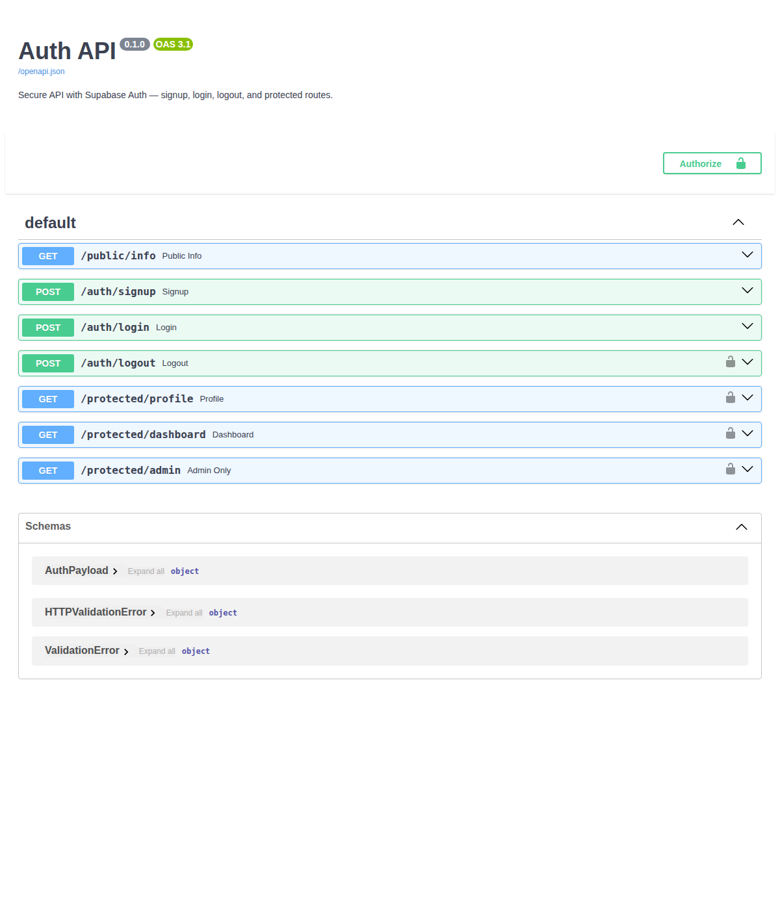

# W4 · A3 — Auth: Login & Protect


**Assignment:** Auth · Login & protect — FlyRank Internship

## What this project is

A secure FastAPI backend that uses **Supabase Auth** as its Identity Provider: users sign up and log in with email/password, Supabase issues a signed JWT, and this API verifies that token on every protected route via a single reusable dependency (FastAPI's version of middleware). No password hashing or token-signing is written by hand — that's the whole point of using an IdP.

```
Client → Supabase        (sign up / log in, get a JWT)
Client → this API        (Authorization: Bearer <JWT>)
this API → Supabase       (verify the token is real)
```

## Project structure

```
W4-A3-auth/
├── main.py                 # FastAPI app, all routes
├── supabase_client.py       # Supabase client, initialized from .env
├── auth/
│   ├── __init__.py
│   └── dependencies.py      # get_current_user — the single reusable auth guard
├── requirements.txt
├── .env.example
└── .gitignore
```

## Setup

1. Create a free project at [supabase.com](https://supabase.com) (no card required).
2. In **Project Settings → API**, copy your **Project URL** and **anon key** (never the `service_role` key here).
3. In **Authentication → Sign In / Providers → Email**, turn **off** "Confirm email" so test signups can log in immediately.
4. Copy `.env.example` to `.env` and fill in your real values:

```bash
cp .env.example .env
```

```
SUPABASE_URL=your_project_url
SUPABASE_KEY=your_anon_key
PORT=8000
```

## How to run

```bash
pip install -r requirements.txt
uvicorn main:app --reload
```

Server logs `Server running and connected to Supabase` on startup with no errors. Open `http://127.0.0.1:8000/docs` for Swagger UI.

## API reference

| Method | Route | Auth required | Status codes |
|---|---|---|---|
| GET | `/public/info` | None | `200` |
| POST | `/auth/signup` | None | `201` created · `400` missing fields |
| POST | `/auth/login` | None | `200` with access + refresh token · `400` missing fields · `401` invalid credentials |
| GET | `/protected/profile` | **Bearer token** | `200` · `401` missing/invalid/expired token |
| GET | `/protected/dashboard` | **Bearer token** | `200` · `401` — proves the guard is reusable across routes |
| POST | `/auth/logout` | **Bearer token** | `204` no content |
| GET | `/protected/admin` | **Bearer token + admin email** | `200` · `401` not logged in · `403` logged in but not an admin |

## Testing it

**Via curl:**
```bash
# Sign up
curl -i -X POST http://localhost:8000/auth/signup \
  -H "Content-Type: application/json" \
  -d '{"email":"test@example.com","password":"password123"}'

# Log in — copy the access_token from the response
curl -i -X POST http://localhost:8000/auth/login \
  -H "Content-Type: application/json" \
  -d '{"email":"test@example.com","password":"password123"}'

# Call the protected route
curl -i http://localhost:8000/protected/profile \
  -H "Authorization: Bearer <PASTE_ACCESS_TOKEN>"
```

Changing one character of the token should flip the response from `200` to `401 Invalid or expired token`.

**Via Swagger UI:** open `/docs`, click the green **Authorize** padlock, paste your access token, then use "Try it out" directly on `/protected/profile` — no curl needed.

## Swagger UI screenshot



Confirmed via the generated OpenAPI spec: `/auth/signup`, `/auth/login`, and `/public/info` carry no security requirement (no lock), while `/auth/logout`, `/protected/profile`, `/protected/dashboard`, and `/protected/admin` all declare `HTTPBearer` security — which is exactly what puts the padlock icon on them in `/docs`.

## Design notes

- **One guard, reused everywhere**: `get_current_user` in `auth/dependencies.py` is the only place that extracts and verifies a token. Every protected route just adds `Depends(get_current_user)` — adding `/protected/dashboard` required zero new auth code.
- **Two distinct 401s**: "Access token required" (no token presented) vs. "Invalid or expired token" (token presented but Supabase rejects it) — these map to genuinely different problems for a client to debug.
- **401 vs 403**: `/protected/admin` demonstrates the difference — an unauthenticated request gets `401` ("I don't know you"), while an authenticated non-admin gets `403` ("I know you, and no").
- **Validation returns 400, not FastAPI's default 422**: `email`/`password` are typed as `Optional[str]` in the request model specifically so a missing field is checked manually and returned as `400`, matching the assignment's spec rather than FastAPI's default validation status code.

## Checklist

- [x] Server starts on localhost with one documented command (`uvicorn main:app --reload`)
- [x] `.env` is used and `.gitignore`'d; `.env.example` committed with placeholder values
- [x] `POST /auth/signup` and `POST /auth/login` call Supabase Auth
- [x] `GET /protected/profile` extracts and verifies the bearer token via Supabase
- [x] Correct status codes: `201` signup, `200` login/read, `204` logout, `400` missing input, `401` bad/missing/expired token
- [x] Auth check extracted into a reusable dependency, applied to 4 different routes
- [x] Swagger UI at `/docs` shows the lock icon on protected routes, verified via the OpenAPI spec
- [x] Bonus: real `403` case (`/protected/admin`) distinguishing authentication from authorization
- [ ] Public GitHub repo pushed with ≥6 commits (see suggested commit sequence below)

## Suggested commit sequence (matches the assignment's 6+ stages)

```bash
git add supabase_client.py .env.example .gitignore
git commit -m "Stage 0: setup server and supabase client"

git add main.py
git commit -m "Stage 1: signup and login routes working"

git commit -am "Stage 2: public route and unverified protected route"

git add auth/
git commit -am "Stage 3: profile route token verification"

git commit -am "Stage 4: auth middleware and logout endpoint"

git add swagger-preview.png
git commit -am "Stage 5: Swagger UI documentation with bearer auth"

git add README.md requirements.txt
git commit -am "Stage 6: publish to GitHub and write README"
```

(Since this was built as a complete unit, you can also just split these into a few honest logical commits reflecting what you actually tested and verified locally — 6 clean commits, not 6 padded ones.)