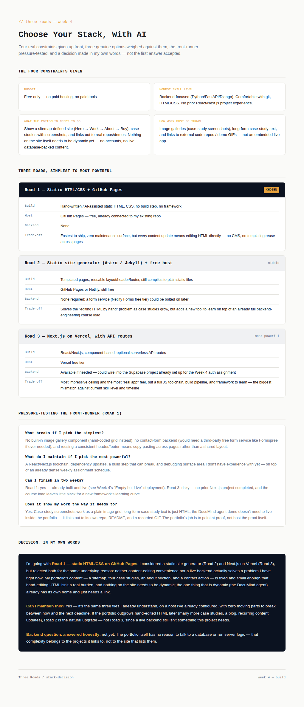

# Week 4 — Three Roads: Choose Your Stack with AI

**Assignment:** Three Roads: Choose Your Stack with AI — FlyRank Internship

## Overview

The exercise isn't "pick a stack" — it's giving AI real constraints (budget, honest skill level, what the portfolio actually needs to do, how the work must be displayed), forcing three genuine options instead of one obeyed answer, pressure-testing the front-runner, and deciding in my own words rather than accepting the first suggestion.

## Contents

| File | Description |
|---|---|
| `stack-decision.html` | The full deliverable: four constraints, three roads compared, the pressure test, and the written rationale. |
| `stack-decision-preview.png` | Rendered screenshot of the page above. |

## The four constraints

- **Budget**: free only
- **Honest skill level**: backend-focused (Python/FastAPI/Django), comfortable with git/HTML/CSS, no prior React/Next.js project
- **What the portfolio needs to do**: display a fixed sitemap (Hero/Work/About/Buy) and case studies — nothing on the site itself needs to be dynamic
- **How work must be shown**: image galleries, long-form case-study text, links out to real repos/demos — not an embedded live app

## Three roads

| Road | Build | Host | Backend | Verdict |
|---|---|---|---|---|
| **1 — Static HTML/CSS** | Hand-written, no build step | GitHub Pages | None | **Chosen** |
| 2 — Static site generator | Astro/Jekyll, templated | GitHub Pages / Netlify | None (form service optional) | Rejected — solves a problem I don't have yet |
| 3 — Next.js on Vercel | React, API routes | Vercel free tier | Available, could use existing Supabase project | Rejected — biggest skill/timeline mismatch |

## Decision summary

Chose **Road 1** — plain static HTML on GitHub Pages, which is also what's already live from the Week 4 "Empty but Live" assignment. Rejected the static-site generator because content-editing convenience isn't a real problem at this scale (4 pages, fixed content). Rejected Next.js/Vercel because a live backend doesn't solve anything this portfolio actually needs — the one genuinely dynamic thing (the DocuMind agent) already has its own repo and just needs a link, not to be embedded.

**Can I maintain this?** Yes — same 3 file types I already understand, already deployed, zero new moving parts.

**Backend question, honestly**: not yet. The portfolio doesn't need to talk to a database; the projects it links to already do that work themselves.

## Pass / revise checklist (per assignment brief)

- [x] Three genuine options considered with real trade-offs, not one answer obeyed
- [x] Chosen stack is free, matched to real needs, displays the required work correctly
- [x] Rationale written in my own words, includes "can I maintain this"
- [x] Backend question answered honestly ("not yet")